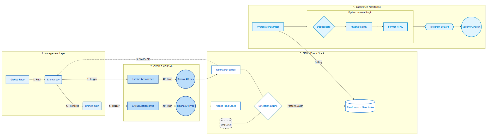

# SIEM Automation Project

# Tổng quan

Dự án này triển khai mô hình Detection-as-Code (DaC) nhằm tự động hóa quy trình quản lý, triển khai và giám sát các quy tắc phát hiện (Sigma Rules) trên nền tảng ELK Stack. Hệ thống sử dụng GitHub Actions để thiết lập CI/CD, kết hợp với một công cụ quản trị giao diện đồ họa (GUI) được viết bằng Python.



## Tính năng chính

- `Triển khai tự động (Automated Deployment)`: Tự động chuyển đổi Sigma Rules sang Elasticsearch Query và đẩy lên Kibana API dựa trên nhánh Git (Dev/Main).
- `Quản lý trạng thái (State Management)`: Cơ chế Sync Audit đối soát thời gian thực giữa kho lưu trữ Local và các rule đang chạy trên SIEM để phát hiện sai lệch cấu hình.
- `Giám sát cảnh báo (Real-time Monitoring)`: Tự động truy vấn các cảnh báo từ Elasticsearch, xử lý trùng lặp (Deduplication) và gửi thông báo qua Telegram.
- `Giao diện quản trị SOC-GUI`: Quản lý vòng đời Rule `(Enable/Disable/Delete/Restore)` một cách trực quan thông qua giao diện CustomTkinter.
- `Tích hợp CI/CD`: Sử dụng GitHub Actions để tự động kiểm tra cú pháp (Linting) bằng Sigma-CLI trước khi triển khai.

## Cấu trúc thư mục

```
SIEM-Automation-Project/
├── .github/workflows/          # GitHub Actions tự động triển khai (ví dụ disable rule)
├── images/                     # Ảnh chụp màn hình & sơ đồ kiến trúc
│   └── workflow.png
├── rules/                      # Rules Sigma / Elastic (định dạng YAML)
├── scripts/                    # Các script Python chính
│   ├── alert.py                # Giám sát cảnh báo & gửi Telegram
│   ├── deploy_to_kibana.py     # Chuyển Sigma → NDJSON → import Kibana
│   └── manager_rule.py         # Logic quản lý rules cho GUI
├── main.py                     # Ứng dụng GUI chính (CustomTkinter)
├── requirements.txt            # Các thư viện Python cần thiết
├── .gitignore
```


## Kiến trúc hệ thống

Hệ thống được chia thành 4 phân tầng chính:

1. `Management Layer`: Lưu trữ Sigma Rules trên GitHub.
2. `CI/CD Layer`: GitHub Actions thực hiện Validate và Deploy.
3. `SIEM Layer`: ELK Stack (Elasticsearch & Kibana) thực thi phát hiện.
4. `Alerting Layer`: Module Python giám sát và gửi cảnh báo qua Telegram.

## Công nghệ sử dụng

- **Ngôn ngữ chính**: Python 3.10+
- **SIEM**: Elastic Stack (Elasticsearch, Kibana, Elastic Security)
- **Định dạng rules**: Sigma → Elastic NDJSON
- **Giao diện**: CustomTkinter
- **Tự động hóa**: GitHub Actions, Elastic API
- **Cảnh báo**: Telegram Bot API
- **Thư viện**: elasticsearch-py, requests, pyyaml, python-dotenv, customtkinter, psutil,...

## Hướng dẫn cài đặt & sử dụng

### Yêu cầu

- Elastic Stack (local hoặc cloud) với 2 space Kibana: dev và default (prod)
- Tài khoản GitHub
- Telegram Bot + Chat ID
- Sigma CLI (`pip install sigma-cli`)

### Các bước cài đặt

1. Clone repository
   ```bash
   git clone https://github.com/yuhrt05/SIEM-Automation-Project.git
   cd SIEM-Automation-Project
   ```
2. Cài thư viện 
    ```
    pip install -r requirements.txt
    ```
3. Tạo file .env
    ```
    ELASTIC_HOST1=https://elastic-cua-ban:9200
    ELASTIC_HOST2=https://kibana-cua-ban:5601
    ELASTIC_USER=elastic
    ELASTIC_PASS=matkhau
    TELEGRAM_TOKEN=token-bot-cua-ban
    TELEGRAM_CHAT_ID=id-chat
    INDEX_DEV=logs-*
    INDEX_PROD=logs-*
    ```
4. Chạy ứng dụng
     ```
    python main.py
     ```
    
