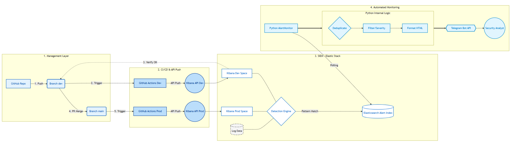

## SIEM Automation
Hệ thống quản lý Sigma Rules dựa trên mô hình DaC và giám sát cảnh báo tập trung cho ELK Stack thông qua giao diện GUI và tự động hóa CI/CD.

### Các module chính
- main.py: Khởi chạy giao diện chính.
- manager.py: Xử lý logic quản lý file Sigma trên repo và Kibana
- alert.py: Engine chạy song song để quét log, khử trùng lặp (Deduplicate) và đẩy cảnh báo qua Telegram API.
- deploy.py: Script thực hiện việc chuyển đổi Sigma Rule sang Elastic Query và triển khai lên Kibana.
- .github\workflows\deploy.yml: Chứa kịch bản CI/CD Pipeline. Tự động kích hoạt khi có thay đổi trong thư mục rules/ để thực hiện kiểm tra cú pháp và triển khai rule lên Kibana.
- rules/: Thư mục lưu trữ các file Sigma (.yml) mẫu.

### Cài đặt chi tiết
1. Yêu cầu:

Trước khi bắt đầu, hãy đảm bảo bạn đã cài đặt:
- SIEM Core: ELK Stack version 8.x (Elasticsearch & Kibana)
- Data Collection: Winlogbeat (đẩy logs từ Local về Elasticsearch) -  cài trên máy Victim 
- Environment: 
    - Python 3.10+ 
    - Git: Version Control, checkout dev/main, CI/CD.
2. Clone repository & Fork

**Quan trọng**: Bạn cần phải Fork Repo này về repo cá nhân của mình, lưu ý có 2 nhánh dev/main.
- Nhánh dev: Dùng để thử nghiệm các rules mới trên môi trường Sandbox.
- Nhánh main: Chứa các rules đã được kiểm duyệt, coi như đang dùng để theo dõi môi trường Production.

```Bash
git clone https://github.com/yuhrt05/SIEM-Automation-Project/
cd <repo-folder>
```

3. Cài đặt thư viện:

```Bash
pip install -r requirements.txt
```
4. Cấu hình .env:

- LOCAL

Tạo file `.env` tại thư mục `/scripts/` của dự án trên máy Local với nội dung sau:

```Plaintext
ELASTIC_HOST=https://<your_ip>:9200
KIBANA_HOST=http://<your_ip>:5601
ELASTIC_USER=elastic
ELASTIC_PASS=<password>
TELEGRAM_TOKEN=<bot_token>
TELEGRAM_CHAT_ID=<chat_id>
INDEX_PROD=.internal.alerts-security.alerts-default-*
INDEX_DEV=.internal.alerts-security.alerts-detection-dev-*
KIBANA_SPACE_PROD=default
KIBANA_SPACE_DEV=detection-dev
```
- Cấu hình GitHub Secrets

Để GitHub Actions có thể deploy rule lên Kibana, bạn cần cấu hình GitHub Secrets trong phần cài đặt repo của bạn:


### Cách Sử dụng
1. Chạy giao diện quản trị
```Bash
python main.py
``` 
2. Add Rules: Có thể tự viết hoặc có thể dùng nguồn có sẵn như SigmaHQ

3. Deploy

- Sửa/Xóa/Cập nhật rule trên nhánh dev -> git push -> Kiểm tra kết quả trên Kibana Dev Space
- Merge Pull Request sang main -> Hệ thống tự động đẩy rule lên Kibana Production.

## Lưu ý quan trọng về Networking::

Để GitHub Actions có thể giao tiếp với Kibana Server đang chạy tại Local, bạn cần một Public URL.
- Giải pháp: Có thể sử dụng Ngrok hoặc Cloudflare Tunnel tạm thời nếu chưa có domain để expose port Kibana ra ngoài Internet một cách an toàn mà không cần mở Port trên Router.